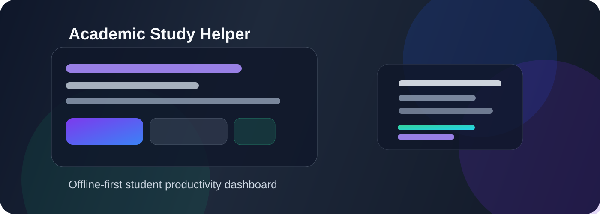

<div align="center">


<br/>

[](https://mausd34.github.io/Academic-Study-Helper/)
[](https://github.com/Mausd34/Academic-Study-Helper/actions)
[](https://mausd34.github.io/Academic-Study-Helper/)
[](package.json)
[](tools/test-core.mjs)

</div>

## 🧩 Project Base

<p align="center">
  
</p>

Academic Study Helper is a personal academic command center designed for students who want a single place to manage classes, tasks, attendance, notes, exam prep, skills, finance, and study focus. The project is built as a fast, installable PWA with an offline-first workflow and a local FastAPI backend for optional AI assistance.

### Quick overview
- Personal dashboard for academic life
- Routine and attendance planning
- Task, exam, note, and expense tracking
- Focus timer and study statistics
- Skill and career growth roadmap
- Offline-first local-first experience
- Ready for optional backend AI integration

---

## 👨‍💻 About the Developer

<table>
<tr>
<td width="60%">

**Masud Rana**  
🎓 B.Sc. in Computer Science & Engineering  
🏛️ International University of Business Agriculture and Technology (IUBAT)  
📍 Dhaka, Bangladesh · Fall 2026

I built this entire application solo — from architecture design to deployment — to solve my own academic organisation problem. Every module, algorithm, and UI component was written by hand without any library or framework.

</td>
<td width="40%" align="center">

```
Focus Areas
───────────────────────
✦ Full-Stack Web Dev
✦ PWA & Offline-First Apps
✦ Data Analysis & ML
✦ Python & FastAPI Backend
✦ Algorithm Design
✦ UI/UX Engineering
```

</td>
</tr>
</table>

---

## 🛠️ Skills Demonstrated in This Project

> This project was built **entirely from scratch** to demonstrate real engineering capability — not tutorial code.

### Frontend Engineering


- **Vanilla ES Modules** — architected a modular SPA without React, Vue, or any framework
- **Reactive State Management** — built a custom pub/sub store from scratch (like Redux, but 50 lines)
- **Client-Side Routing** — hash-based SPA router with lazy-loaded dynamic view imports
- **Offline-First PWA** — Service Worker with cache-first strategy, installable on any device
- **Custom SVG Charts** — bar charts, doughnut rings, and progress arcs without Chart.js
- **Responsive Design** — CSS Grid + Flexbox, mobile-first, dark/light/system theme
- **Accessibility** — ARIA roles, semantic HTML landmarks, keyboard navigation, skip links
- **XSS Security** — custom HTML sanitiser for all user-controlled content

### Software Engineering Practices


- **CI/CD Pipeline** — GitHub Actions auto-deploys to GitHub Pages on every `git push`
- **Custom Test Runner** — 37 headless unit + integration tests written without Jest or Mocha
- **Static Analysis Tooling** — wrote `check-syntax`, `check-imports`, `check-css`, `check-classes` tools from scratch
- **Schema Migration Engine** — versioned LocalStorage with automatic v1→v2→v3→v4 data migration
- **Chrome DevTools Protocol** — raw WebSocket CDP client for E2E browser testing
- **Separation of Concerns** — clean layered architecture: `core/` engine vs `views/` rendering

### Algorithms & Logic
- **Attendance Forecasting** — linear equation solver that calculates exact safe-miss count and recovery plan
- **Priority Queue Engine** — multi-factor scoring for recommendations (urgency × distance × attendance)
- **Bilingual NLP** — keyword-based query matching with English & বাংলা (Bengali) answer routing
- **Pomodoro Timer Engine** — state machine with session tracking and browser Notification API

---

## 🎯 Project Overview

**Academic Study Helper** is a mobile-first, installable PWA — a complete personal academic operating system built for CSE students at IUBAT. It runs 100% in the browser with no backend, no database server, and no internet connection required.

**The challenge I set myself:**
> Build a production-grade web application with zero runtime dependencies, zero bundlers, a full test suite, CI/CD pipeline, and offline support.

---

## ✨ Feature Set (16 Modules)

<details>
<summary><b>📊 Dashboard</b> — Smart home screen</summary>

- Real-time class status (Now / Next / Done) with live countdown
- Recommendation engine surfacing urgent actions (low attendance, imminent exams)
- At-a-glance: today's schedule, pending tasks, nearest deadline

</details>

<details>
<summary><b>🗓️ Class Routine</b> — Weekly timetable engine</summary>

- Full CSE Fall 2026 timetable with automatic current-day detection
- Class status derived from system clock, not static data
- Weekly load analysis (total minutes per course)

</details>

<details>
<summary><b>✅ Attendance Tracker</b> — Forecasting engine</summary>

- Per-course attendance log (present / absent / holiday)
- **Forecasting algorithm** — computes exactly how many more classes you can miss while staying above 80%, or how many consecutive classes needed to recover
- Colour-coded risk bands: Safe / At-Risk / Critical

</details>

<details>
<summary><b>📝 Tasks · 📅 Exams · 📚 Notes</b> — Academic management</summary>

- Task manager: due dates, priorities, status pipeline, full-text search
- Exam calendar: countdown timers, urgency colour coding
- Markdown-rendered notes with per-course organisation

</details>

<details>
<summary><b>⏱️ Pomodoro Timer</b> — Focus engine</summary>

- Configurable focus / short-break / long-break intervals
- Session statistics with total focus-hours tracking
- Desktop notifications via browser Notification API

</details>

<details>
<summary><b>💰 Expense Tracker</b> — Financial overview</summary>

- Bangladesh Taka (৳) expense log with categories and dates
- Monthly summaries with SVG doughnut chart breakdown

</details>

<details>
<summary><b>⚡ Skills · 🚀 Career · 📖 Learning</b> — Growth tracking</summary>

- Skills: Python, SQL, ML, Data Analysis, Git, FastAPI, Flutter, DSA
- Four-month career roadmap with milestone progress bars
- Learning plan with curated resource links

</details>

<details>
<summary><b>📈 Analytics</b> — Data visualisation</summary>

- Task completion trend (weekly bar chart)
- Expense trends over time, coding problem breakdown
- All charts built with hand-rolled SVG — no Chart.js

</details>

<details>
<summary><b>🤖 Study Assistant</b> — Bilingual AI</summary>

- Offline keyword-based knowledge base for CSE topics
- Responds in **English** or **বাংলা** based on query language
- Architecture ready for Gemini API via secure backend proxy

</details>

<details>
<summary><b>⚙️ Settings</b> — Personalisation & data</summary>

- Light / Dark / System theme with instant toggle
- Language: English ↔ বাংলা (full i18n, 100% key parity)
- Full JSON export & import for backup / restore
- Profile editing (name, semester, programme)

</details>

---

## 🏗️ Architecture

```
┌─────────────────────────────────────────────────────────┐
│                     Browser (PWA Shell)                 │
│                                                         │
│  index.html ──── styles.css ──── js/app.js              │
│                                    │                    │
│            ┌───────────────────────┤                    │
│            │        Core Layer     │                    │
│            │  store.js (state)     │                    │
│            │  router.js (nav)      │                    │
│            │  storage.js (I/O)     │                    │
│            │  ui.js / parts.js     │                    │
│            │  analytics / routine  │                    │
│            │  recommend / assistant│                    │
│            └───────────┬───────────┘                    │
│                        │  lazy import()                 │
│            ┌───────────▼───────────┐                    │
│            │     Views Layer (16)  │                    │
│            │  dashboard · routine  │                    │
│            │  attendance · tasks   │                    │
│            │  exams · notes ···    │                    │
│            └───────────────────────┘                    │
│                                                         │
│  sw.js ── Service Worker (cache-first, offline)         │
└─────────────────────────────────────────────────────────┘
         │
         ▼  git push main
┌────────────────────┐
│   GitHub Actions   │  ← CI/CD in 20 seconds
│   deploy.yml       │
└────────┬───────────┘
         ▼
┌────────────────────┐
│   GitHub Pages     │  https://mausd34.github.io/
│   (Live, HTTPS)    │  Academic-Study-Helper/
└────────────────────┘
```

---

## 🗄️ Cloud Sync (Supabase)

**Optional.** The app is 100% functional with no backend — everything lives in localStorage. Signing in adds cloud backup across devices.

### Schema

Migrations live in [`supabase/`](supabase/) and run in order:

| File | Purpose |
|---|---|
| `001_schema.sql` | 17 tables, indexes, `updated_at` triggers |
| `002_rls.sql` | **Row Level Security + own-rows-only policies** |
| `003_seed_reference.sql` | Optional Fall 2026 reference data |

Apply via dashboard → **SQL Editor**, or `supabase db push`.

### ⚠️ Read this before going live

`002_rls.sql` is the only thing protecting your data. The `sb_publishable_...` key in `js/core/config.js` is **designed to be public** — it ships to every browser, and it is already in git history. RLS is what stops that key from reading your rows.

Verify after migrating:

```sql
select relname, relrowsecurity
from pg_class
where relnamespace = 'public'::regnamespace and relkind = 'r'
order by relname;
```

Every row must show `relrowsecurity = true`. Any `false` means that table is world-readable.

### Known gaps

- `sync.js` still writes the whole state into `user_data` as one JSON blob; the 17 collection tables are ready but unpopulated.
- `supabase.js` imports the SDK from jsDelivr, which **breaks offline** and breaks the zero-dependency rule in `.clinerules`.
- The key is hardcoded in `config.js` — move it to runtime config if you'd rather rotate it outside git.

---

## 🧪 Quality & Testing

```bash
npm run check   # Runs 4 static analysis tools:
                #   ✓ check-syntax.mjs   — 49 files, 0 syntax errors
                #   ✓ check-imports.mjs  — all ES module paths resolve
                #   ✓ check-css.mjs      — CSS well-formed, 189 classes
                #   ✓ check-classes.mjs  — markup ↔ CSS contract verified

npm test        # Runs 37 assertions across 2 test suites:
                #   ✓ test-core.mjs     — 29 tests (safety, logic, i18n)
                #   ✓ test-storage.mjs  —  8 tests (schema, migration)
```

**All tools were written from scratch in Node.js** — no test framework, no linter configuration files, no build config.

---

## 🚀 Run Locally

```bash
git clone https://github.com/Mausd34/Academic-Study-Helper.git
cd Academic-Study-Helper
npm run serve         # → http://localhost:8000
```

> No `npm install` required. Zero dependencies.

---

## 📂 Tech Stack

| | Technology | Why |
| :---: | :--- | :--- |
| 🖥️ | **Vanilla HTML5 + CSS3 + JavaScript ES2022** | Zero overhead, maximum control |
| 🔁 | **Native ES Modules** | No bundler, loads natively in any modern browser |
| 🗄️ | **LocalStorage + versioned schema** | Offline-first, no backend required |
| 📡 | **Service Worker (Cache-First)** | Full offline capability, installable PWA |
| 📊 | **Hand-rolled SVG charts** | No Chart.js, pixel-perfect, 0 kb overhead |
| 🔀 | **Custom pub/sub reactive store** | No Redux/Zustand — 50 lines, same concept |
| 🤖 | **GitHub Actions CI/CD** | Auto-deploys to GitHub Pages on every push |
| 🧪 | **Custom Node.js test runner** | No Jest/Mocha — built from scratch |

---

## 📬 Contact

<div align="center">

**Masud Rana**

[](https://github.com/Mausd34)
[](https://mausd34.github.io/Academic-Study-Helper/)

*Open to internship and entry-level software engineering roles.*  
*Comfortable in JavaScript, Python, and full-stack web development.*

---

> *"I don't just use tools — I build them."*

**[→ Open the Live App](https://mausd34.github.io/Academic-Study-Helper/)**

</div>
